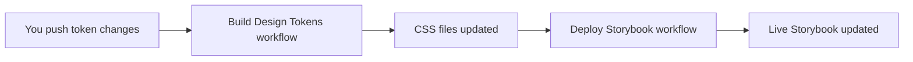

# 🚀 Automatic Token Rebuilding & Storybook Deployment Setup

## ✅ What's Already Configured

Your repository now has **automatic automation** set up:

### 🔄 **Automatic Token Rebuilding**
- **Triggers:** When you push changes to `tokens/` directory
- **What it does:** Automatically rebuilds CSS files and commits them
- **Result:** Your Storybook always has the latest token changes

### 🌐 **Automatic Storybook Deployment**
- **Triggers:** When CSS files are updated (from token rebuilding)
- **What it does:** Builds and deploys Storybook to GitHub Pages
- **Result:** Live Storybook at `https://uxdelta.github.io/muka/`

## 🎯 **How It Works**



## 🛠️ **Setup Steps**

### 1. Enable GitHub Pages (Required)

**Go to your repository settings:**
1. Navigate to `https://github.com/uxdelta/muka/settings/pages`
2. Under "Source", select **"GitHub Actions"**
3. Click **"Save"**

### 2. Test the Automation

```bash
# Make a small token change to test
echo '{"test": "automation"}' >> tokens/test-automation.json

# Commit and push
git add .
git commit -m "test: automation setup"
git push origin main
```

### 3. Monitor the Workflows

**Check the Actions tab:**
1. Go to `https://github.com/uxdelta/muka/actions`
2. Watch the "Build Design Tokens" workflow run
3. Then watch the "Deploy Storybook" workflow run

## 📊 **Workflow Details**

### Build Design Tokens Workflow
- **File:** `.github/workflows/build-tokens.yml`
- **Triggers:** Push to `main` with changes to:
  - `tokens/**` (any token files)
  - `build/manifest.json`
  - `scripts/build-tokens.js`
- **Actions:**
  1. Installs dependencies
  2. Runs `node scripts/build-tokens.js`
  3. Commits updated CSS files
  4. Pushes changes back to repository

### Deploy Storybook Workflow
- **File:** `.github/workflows/deploy-storybook.yml`
- **Triggers:** 
  - Push to `main` with changes to CSS/components
  - Completion of "Build Design Tokens" workflow
- **Actions:**
  1. Installs dependencies
  2. Runs `npm run build-storybook`
  3. Deploys to GitHub Pages
  4. Updates live Storybook

## 🎨 **Your Workflow**

### Daily Development
1. **Edit tokens** in `tokens/` directory
2. **Commit and push** your changes
3. **Automation handles the rest:**
   - CSS files are rebuilt automatically
   - Storybook is deployed automatically
   - Your team gets the latest changes

### No More Manual Steps!
- ❌ No more `npm run build:tokens`
- ❌ No more `npm run build-storybook`
- ❌ No more manual deployments
- ✅ **Everything happens automatically!**

## 🔍 **Monitoring & Debugging**

### Check Workflow Status
```bash
# View recent workflow runs
gh run list --repo uxdelta/muka

# View specific workflow logs
gh run view [RUN_ID] --repo uxdelta/muka
```

### Common Issues & Solutions

**Workflow Not Running:**
- Check if GitHub Pages is enabled
- Verify you're pushing to `main` branch
- Check file paths match workflow triggers

**Storybook Not Deploying:**
- Ensure GitHub Pages source is set to "GitHub Actions"
- Check workflow permissions
- Verify `npm run build-storybook` works locally

**CSS Files Not Updating:**
- Check token file syntax (valid JSON)
- Verify `build/manifest.json` configuration
- Check `scripts/build-tokens.js` runs successfully

## 🎉 **Benefits**

✅ **Automatic Token Rebuilding** - No manual CSS generation  
✅ **Automatic Storybook Deployment** - Always up-to-date documentation  
✅ **Team Collaboration** - Everyone gets latest changes instantly  
✅ **Consistent Process** - Same workflow every time  
✅ **Error Prevention** - Automated validation and testing  

## 🚫 **Disable If Needed**

If you ever want to disable automation:

```bash
npm run disable:automation
```

To re-enable later:

```bash
npm run enable:automation
```

---

**Your design system is now fully automated! 🎨✨**
