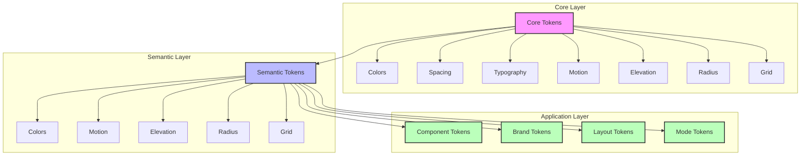

# Design Tokens Documentation

This directory contains all design tokens for the design system, organized in a hierarchical structure that promotes maintainability and scalability.

## Token Hierarchy

The tokens follow a clear hierarchy:

1. **Core Tokens** (`/core`)
   - Raw values and base tokens
   - Never referenced directly by components
   - Includes: colors, spacing, typography, motion, elevation, radius, grid

2. **Semantic Tokens** (`/semantic`)
   - References core tokens
   - Provides meaningful, purpose-driven names
   - Single source of truth for design decisions
   - Includes: colors, motion, elevation, radius, grid

3. **Component Tokens** (`/component`)
   - References semantic tokens
   - Defines component-specific styles
   - Includes: button, input, etc.

4. **Brand Tokens** (`/brand`)
   - References semantic tokens
   - Defines brand-specific overrides
   - Includes: muka, ormilon

5. **Layout Tokens** (`/layout`)
   - References semantic tokens
   - Defines responsive layout configurations
   - Includes: mobile, tablet, desktop

6. **Mode Tokens** (`/mode`)
   - References semantic tokens
   - Defines theme variations
   - Includes: light, dark

### Token Hierarchy Diagram



The diagram above illustrates:
- **Core Layer** (Pink): Raw values and base tokens
- **Semantic Layer** (Blue): Purpose-driven tokens that reference core tokens
- **Application Layer** (Green): Implementation-specific tokens that reference semantic tokens

## Directory Structure

```
tokens/
├── core/               # Raw values and base tokens
├── semantic/           # Purpose-driven tokens
├── component/          # Component-specific tokens
├── brand/             # Brand-specific tokens
├── layout/            # Responsive layout tokens
├── mode/              # Theme mode tokens
├── $metadata.json     # Token metadata
└── $themes.json       # Theme configurations
```

## Token Categories

### Core Tokens
- `color.json`: Base color palette
- `spacing.json`: Base spacing scale
- `typography.json`: Base typography settings
- `motion.json`: Animation durations and easing
- `elevation.json`: Shadow definitions
- `radius.json`: Border radius values
- `grid.json`: Breakpoints and container sizes

### Semantic Tokens
- `color.json`: Purpose-driven color tokens
- `motion.json`: Semantic motion tokens
- `elevation.json`: Semantic elevation tokens
- `radius.json`: Semantic radius tokens
- `grid.json`: Semantic grid tokens

### Component Tokens
- `button.json`: Button styles and states
- `input.json`: Input field styles and states

### Brand Tokens
- `muka.json`: Muka brand configuration
- `ormilon.json`: Ormilon brand configuration

### Layout Tokens
- `mobile.json`: Mobile layout configuration
- `tablet.json`: Tablet layout configuration
- `desktop.json`: Desktop layout configuration

### Mode Tokens
- `light.json`: Light theme configuration
- `dark.json`: Dark theme configuration

## Usage Guidelines

1. **Never reference core tokens directly** in components or brand configurations
2. **Always use semantic tokens** as the source of truth for design decisions
3. **Use component tokens** for component-specific styling
4. **Use brand tokens** for brand-specific overrides
5. **Use layout tokens** for responsive design
6. **Use mode tokens** for theme variations

## Token References

### Color References
```json
{
  "semantic.color.background.primary": "Base background color",
  "semantic.color.text.primary": "Primary text color",
  "semantic.color.action.primary.background": "Primary action background"
}
```

### Motion References
```json
{
  "semantic.motion.transition.fast": "Fast transition",
  "semantic.motion.interaction.hover": "Hover interaction"
}
```

### Elevation References
```json
{
  "semantic.elevation.surface.default": "Default surface elevation",
  "semantic.elevation.interactive.hover": "Hover state elevation"
}
```

### Radius References
```json
{
  "semantic.radius.surface.card": "Card border radius",
  "semantic.radius.interactive.button": "Button border radius"
}
```

### Grid References
```json
{
  "semantic.grid.breakpoint.mobile": "Mobile breakpoint",
  "semantic.grid.container.default": "Default container width"
}
```

## Best Practices

1. **Maintain Hierarchy**
   - Core → Semantic → Component/Brand/Layout/Mode
   - Never skip levels in the hierarchy

2. **Naming Conventions**
   - Use semantic names that describe purpose
   - Follow consistent naming patterns
   - Use camelCase for token names

3. **Token Types**
   - Always specify the correct type
   - Use appropriate value formats
   - Maintain consistent units

4. **Documentation**
   - Keep this documentation updated
   - Document any new token categories
   - Include usage examples

5. **Version Control**
   - Review token changes carefully
   - Consider impact on existing components
   - Test changes across all themes

## Contributing

When adding new tokens:
1. Follow the established hierarchy
2. Use semantic naming
3. Reference existing tokens when possible
4. Update this documentation
5. Test across all themes and components 